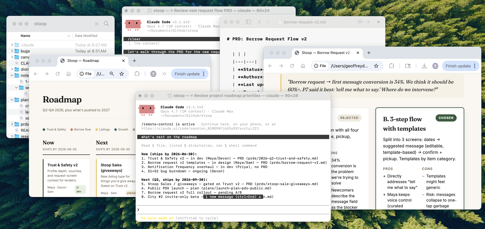
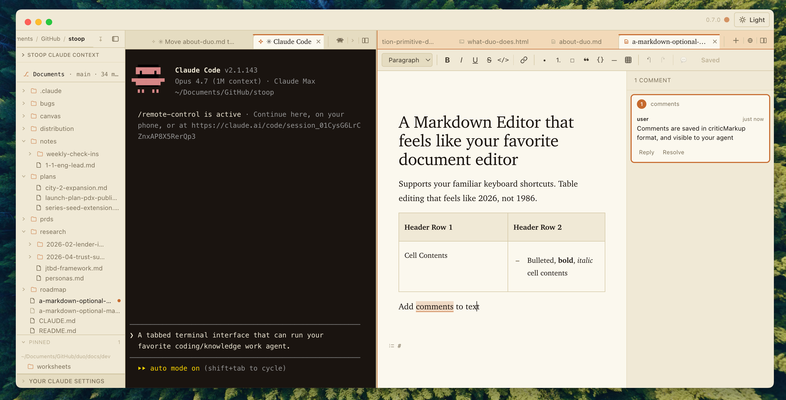

# About Duo

## The problem I am trying to solve

Working with Claude Code outside of an IDE often means juggling multiple windows from multiple applications.

In my average workflow, I am:

- Running multiple **terminal windows**
- Editing multiple **markdown files**
- Manually looking up **files and folders in Finder** and setting CWD in the terminal via manual terminal command
- Reviewing multiple **html artifacts in browsers**
- Describing what I'm working on, or where to find it, to Claude so it can keep up with where I am in a given flow, often with verbose descriptions (e.g. "the third bullet in the second H2 in prd.md")

There are a lot of ways to improve aspects of this workflow, but I didn't find any that addressed all of them:

- Integrated development environments (IDEs) like VSC offer a flexible three-column view and can be enhanced with extensions – but the markdown editing experience isn't great and the terminal is unreliable for long sessions.
- Claude Desktop is getting better with every release – but it is not available for all enterprise customers and does not yet have a great co-writing experience for artifacts.
- Obsidian offers a great markdown editing experience and can be extended with a terminal – but does not work as well with non-markdown assets

I have tried many alternative terminals (e.g. CMUX, which is great), IDEs, versions of Claude Desktop, but each left me thinking I could build something that fit my needs better.

## Introducing Duo

I built Duo, an agent-friendly IDE for product managers and knowledge workers. It has become my daily driver at work and at home.

Duo is free, open source, does not capture or send any of your data anywhere, and lets you work with whatever agent you want.

At its core, Duo is an IDE for knowledge work, with four main features:

1. **File Navigator that sets and responds to context** – you can use it to find your files, set the CWD for your Claude session, check Github status for linked repos, etc.
2. **Tabbed, connected Terminal** – more work is happening in the terminal, so Duo's terminal is front and center. If you spawn a new terminal session, it sets CWD from the navigator. When you switch tabs, the file navigator responds by opening the current CWD.
3. **Markdown editor that feels like home** – it's all markdown-native under the hood, but unless you view source you don't need to think about Markdown. Use markdown notation (styles rendered real-time) or just use familiar keyboard shortcuts from Google Docs, Word, or Notion.
4. **CLI that ties it all together** – \~anything you can do in the app, your Agent can do via CLI.
   - "Open my the roadmap and scroll to the 'open questions' section"
   - "Navigate to the 'tasks' folder, expand it, and tell me what's in there"
   - "Create a new file, 'product-vision.md', open it, and collapse the terminal and navigator so I can focus"
   - &lt;select element in browser&gt; "Let's make this button inactive until prior steps are completed"

## A closer look at the four pieces

Here's how each of those four pieces actually feels once you're working — and why each one earns its place.

### The Navigator — find your stuff, and tell the agent where to work

The thing I do a hundred times a day is *find a file and then explain to Claude where it is.* "It's in the tasks folder… no, the other one… third from the top." The navigator on the left collapses both of those into a single click.

The obvious half is what you'd expect: a tidy tree of your folders and files — click one to open it. But the half that actually changed my day is quieter: **the navigator is how you tell the agent where to work, without ever touching the command line.** Open a folder here and the next Claude session you start is already working *there* — no typing `cd ..` to climb around, no `ls` to remember what's inside. When I want to start a brand-new piece of work, I point the navigator at wherever it belongs and spin up a fresh agent right on the spot; it inherits the place instead of me describing it. It also keeps track of which projects you're actually working in, so hopping between, say, a roadmap and a research folder is a click rather than a scavenger hunt. You stop being the courier who carries context back and forth between yourself and the agent — the navigator carries it for you.

*[Screenshot: the navigator on the left — your projects and files, with the working folder that sets the agent's context.]*

### The Terminal — where you and the agent actually talk

Most people I show Duo to flinch at the terminal. They've been taught it's where things go wrong. So the first thing worth saying is that in Duo the terminal isn't where you run scary commands — **it's just where you and Claude have a conversation**, and Duo puts it front and center because that's where the work now happens.

The tabs across the top are conversations. One might be Claude drafting a spec with you; another a plain shell you keep around for the occasional thing you'd rather an agent not touch. Two small details make it feel less like "the command line" and more like somewhere you'd happily spend the day. When you open a new tab, it starts in the same place you were already working, so you're never re-navigating from scratch. And the Return key does what a decade of chat apps trained your fingers to expect — Enter sends, Shift-Enter makes a new line (and if you'd rather it the other way, there's a setting). Little things, but they're the difference between a tool that fights your instincts and one that meets them.

*[Screenshot: tabbed terminals across the top — each tab a separate conversation with the agent.]*

### The Canvas — one pane that becomes whatever you open

The right side of the window is what I call the canvas — though "canvas" really just means "the slot." It isn't any one tool; it becomes whatever you put in it. That matters because a knowledge worker's day is a pile of *different kinds* of things — a doc, a mockup, a config an engineer pasted, a competitor's pricing page — and normally each kind drags you into a different app. Here they all live in the one window.

#### A writing surface that feels like home

Open a markdown file and the canvas becomes an editor that works the way Google Docs or Notion taught you. It's plain markdown underneath — which is exactly what lets the file travel cleanly into a repo, onto another machine, or into Claude's hands without anything getting lost — but you never have to *think* in markdown. ⌘B is bold, a dash starts a bullet, the toolbar is right where you'd reach for it. The part that changed how I work, though, is co-writing: select a sentence and leave a comment exactly as you would in Docs, and Claude can read it and reply — because the comment lives right inside the file. Turn on suggesting and the agent's edits arrive as tracked changes you accept or reject one at a time. And when Claude does change something, the new text glows for a moment so you can see what moved without hunting for it.

*[Screenshot: the markdown editor with a comment thread — co-writing a doc with the agent.]*

#### Pages you can actually see

HTML files open as a live, rendered page you can edit directly — what you see is what gets saved. Why this matters for working with an agent: Claude can rewrite *one section* of the page without disturbing the rest. Instead of asking it to regenerate a whole document and hoping it kept the good parts, you say "redo just the pricing table" and it swaps that one block. This is also where the example from earlier pays off — point at a button on the page and tell Claude "make this inactive until the earlier steps are done," and it edits the right piece, because it can see the structure underneath.

*[Screenshot: an HTML page open as a live, editable canvas.]*

#### The configs you get handed

You probably don't write JSON, but you get handed it constantly — an API response someone wants you to sanity-check, a webhook payload, a settings file. Open any of it and instead of a wall of brackets you get a tidy, collapsible tree: open only the part you care about, click a value to change it, and if you fat-finger something Duo tells you where and what, in plain English ("looks like you're missing a closing brace"). It's the kind of thing you don't notice until the day you needed it and it was simply there.

*[Screenshot: a JSON file shown as a collapsible tree instead of a wall of brackets.]*

#### A real browser, right where you're working

Yes, there's a genuine browser tab living inside Duo — logged-in sessions and all. Two reasons it belongs here rather than in a separate window. First, it's where Claude can do web work *for* you: read a page, pull a quote, click through a multi-step flow while you watch. Second — the move I lean on most — highlight anything on a page and a small "send to the agent" prompt appears; click it and that selection lands in your conversation with a note about where it came from, so you can say "turn this into a requirement" without copy-pasting and re-explaining. (One reassurance for anyone on a locked-down work laptop: by default Duo only opens local files and sends real websites out to your normal browser, so the agent can't wander the open internet unless you let it.)

*[Screenshot: highlighting something on a web page and sending it straight to the agent.]*

#### Two things at once

Sometimes one file on screen isn't enough. Split View puts two side by side in the canvas — I use it to keep a spec open next to the notes I'm taking on it, or a checklist visible while I work through the thing it's checking. It survives a restart, so if you put Duo down mid-task it's right where you left it.

*[Screenshot: two documents side by side in Split View.]*

### The CLI — how the agent gets its hands on all of it

Everything I've described, you can do yourself with a mouse and a keyboard. But the reason Duo is built *around* an agent is the last piece: a small command-line tool, `duo`, that lets Claude do all of it too. **You will almost never type these commands yourself.** They're the hands the agent reaches for when you ask, in plain English, for something to happen.

"Open my roadmap and scroll to the open-questions section" becomes a couple of `duo` calls under the hood. "Make a new file called product-vision.md and collapse the terminal so I can focus" is a few more, strung together while you watch the window rearrange itself. That's the whole idea: a normal IDE hands *you* a set of tools. Duo hands the same tools to the agent sitting next to you — so when you ask for something, Claude doesn't tell you what to click. It clicks.

&lt;!-- Screenshots above are placeholders; capture per the slugs in docs/research/docs-deep-clean-decisions.html § screenshot plan. --&gt;