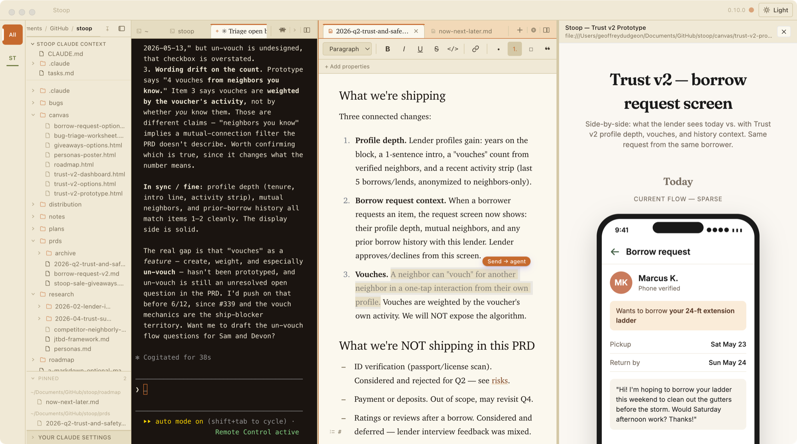
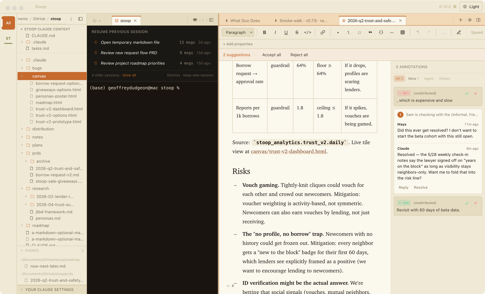
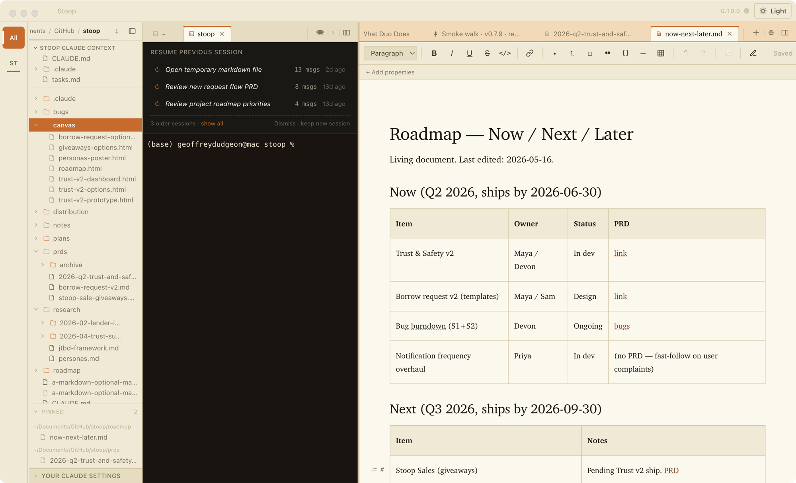
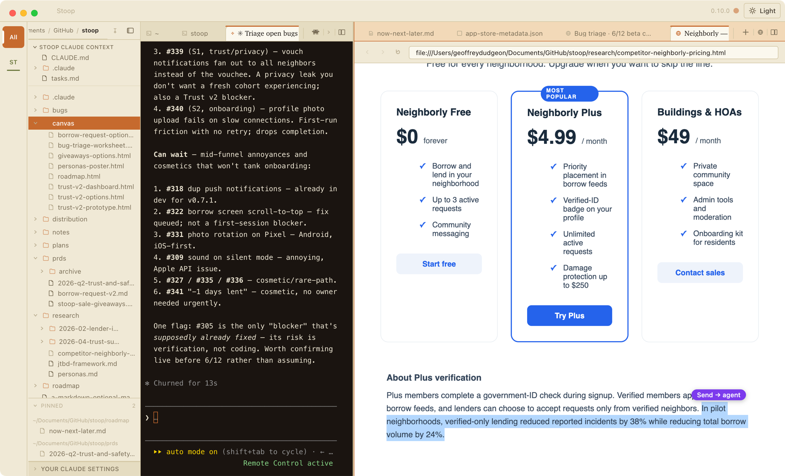
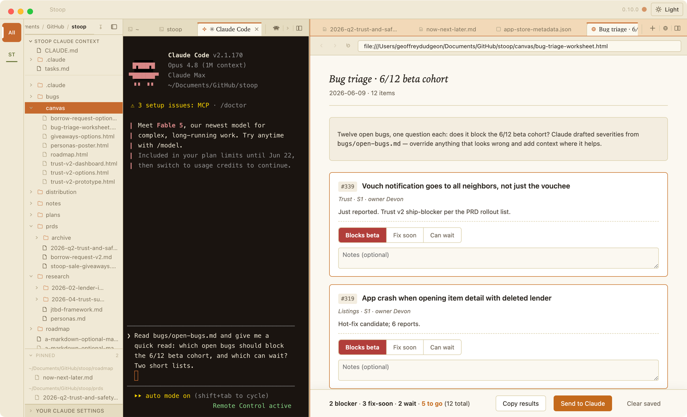
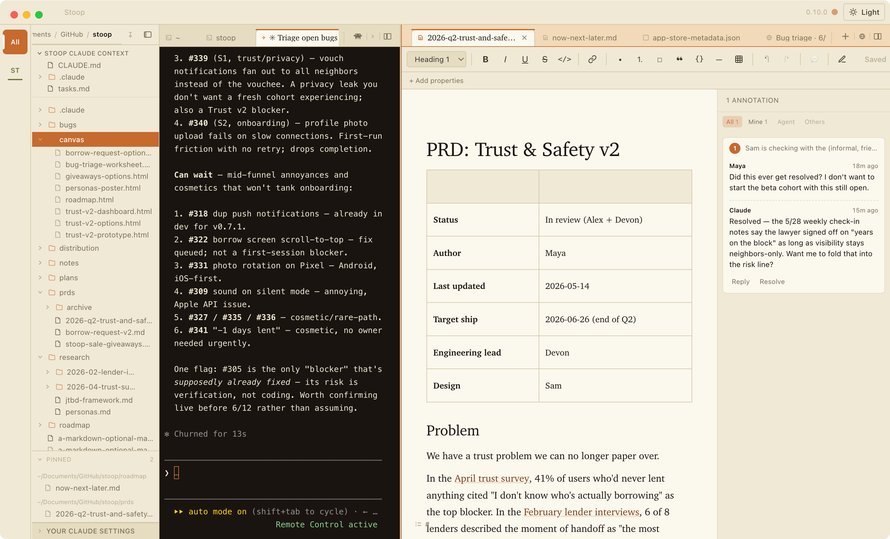
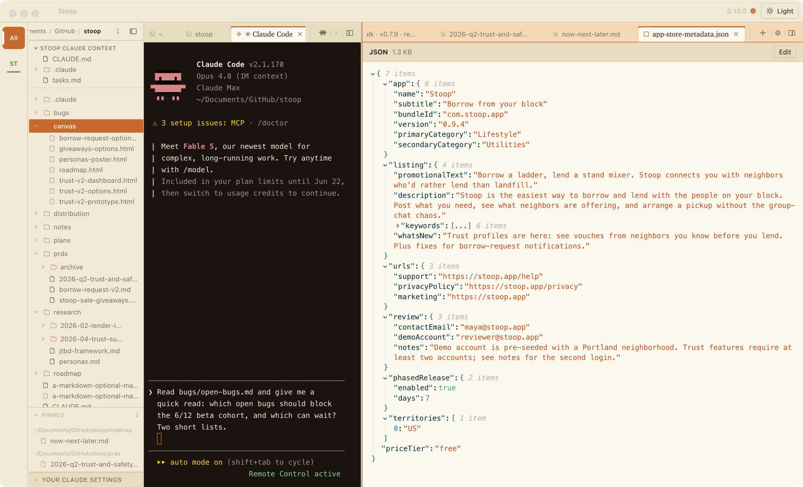
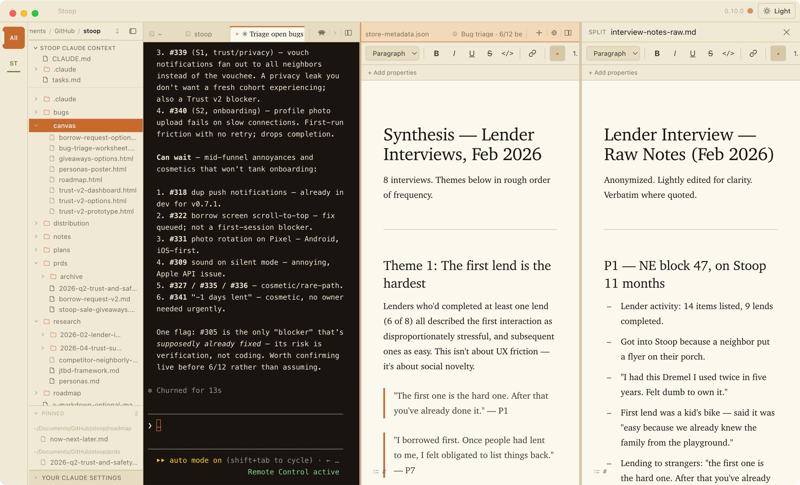

# About Duo

## The problem I am trying to solve

Working with Claude Code outside of an IDE often means juggling multiple windows from multiple applications.

In my average workflow, I am:

- Running multiple **terminal windows**
- Editing multiple **markdown files**
- Hunting for **files and folders in Finder**, then typing folder paths into the terminal to tell it where to work
- Reviewing multiple **html artifacts in browsers**
- Describing what I'm working on, or where to find it, to Claude so it can keep up with where I am in a given flow, often with verbose descriptions (e.g. "the third bullet in the second H2 in prd.md")

There are a lot of ways to improve aspects of this workflow, but I didn't find any that addressed all of them:

- Integrated development environments (IDEs) like VS Code offer a flexible three-column view and can be enhanced with extensions – but the markdown editing experience isn't great and the terminal is unreliable for long sessions.
- Claude Desktop is getting better with every release – but it is not available for all enterprise customers and does not yet have a great co-writing experience for artifacts.
- Obsidian offers a great markdown editing experience and can be extended with a terminal – but does not work as well with non-markdown assets.

I have tried many alternative terminals (e.g. CMUX, which is great), IDEs, versions of Claude Desktop, but each left me thinking I could build something that fit my needs better.

## Introducing Duo

I built Duo, an agent-friendly IDE for product managers and knowledge workers. It has become my daily driver at work and at home.

Duo is free, open source, does not capture or send any of your data anywhere, and lets you work with whatever agent you want.

At its core, Duo is an IDE for knowledge work, with four main features:

1. **A markdown editor that feels like home** – use familiar keyboard shortcuts from Google Docs, Word, or Notion; you never have to think about markdown unless you want to.
2. **A tabbed, connected terminal** – more work is happening in the terminal, so Duo's terminal is front and center, and it always knows which folder you're working in.
3. **A file navigator that sets and responds to context** – find your files, point Claude at the right folder, see what's changed in your team's shared project.
4. **A command-line tool that ties it all together** – nearly anything you can do in the app, Claude can do too. So you can ask for things like:
   - "Open the roadmap and scroll to the 'open questions' section"
   - "Navigate to the 'tasks' folder, expand it, and tell me what's in there"
   - "Create a new file, 'product-vision.md', open it, and give me a full-width view so I can focus"
   - *(after pointing at a button on a page in the browser)* "Let's make this button inactive until prior steps are completed"

The rest of this page walks through what working in Duo is like, one piece at a time. The screenshots come from a demo project: Stoop, a neighborhood lending app, as its (fictional) product manager would see it.

## Writing — an editor that works like the ones you know

You're reviewing a PRD before it goes to engineering. You select a sentence, add a comment — "did this ever get resolved?" — and Claude replies in the thread, citing the meeting note it checked. You flip on Suggesting mode and ask it to tighten the risks section; its edits arrive as tracked changes, and you accept two and reject one.

The editor exists for that review loop: the one you already run in Google Docs, moved onto local files, with Claude as one of the reviewers.

Open any markdown file and it reads like a document, not source code. There's a toolbar, ⌘B bolds, a dash starts a bullet, tables are click-to-edit, and autosave is on. If something else changes a file you have open, Duo warns you and shows a side-by-side diff before anything is overwritten, so you never silently lose work. Underneath it's all plain text, which is why the same file moves cleanly into your team's shared project or any other tool without conversion. Comments and suggestions live inside the file too, so they travel with it.

When Claude edits a document you have open, the changed text glows briefly. You see what moved without re-reading the page.

Smaller things you'd expect are here too: paste an image and it lands in the doc, document properties show as a tidy panel instead of raw text, ⌘F finds, and in Obsidian vaults, `[[wiki-links]]` connect notes to each other.

## The terminal — where you and Claude talk

Most people I show Duo to flinch at the terminal. In practice you'll rarely type commands into it; it's where you talk to Claude, and that conversation gets the biggest pane. It doesn't look like a hacker movie, either — comfortable type, roomy spacing, a light theme if you want one.

Each tab is a conversation. The new-tab button starts Claude already running, in the folder your current terminal is working in, with nothing to set up. Come back the next morning, open a terminal in that folder, and your recent conversations show up as clickable pills with readable titles — so Monday picks up where Friday stopped instead of starting from a blank prompt.

A few defaults are there to protect you. A command copied from Slack won't run itself when you paste it: Duo drops the trailing newline, so it sits at the prompt until you press Return. Enter sends and Shift-Enter makes a new line, the way chat apps trained your fingers (there's a setting if you'd rather have it the other way). And when you need to hand Claude a file mid-sentence, drag it from the navigator into the terminal and the path lands at your cursor.

## The browser — research that Claude can read over your shoulder

A real browser lives inside Duo, with tabs, history, and logins that persist. It's here, rather than in a separate window, so that Claude can read what's on your screen.

Highlight anything on a page and — when Claude is running in your front terminal — a small **Send → agent** pill appears. Click it and the selection lands in your conversation with a note about where it came from. Reading a competitor's pricing page, you can highlight the one clause that worries you and ask "does this change anything for us?" — no copy-paste, no explaining which tab you meant.

It also matters if your work lives in Google's tools: Claude can read a Doc, a Sheet, a Slides deck, or a Figma file open in the pane — the doc you're actually logged into, no connectors or downloads needed. And Claude can drive the browser as well as read it: click through a flow, fill a form, or inspect the specific button you point at.

One reassurance for anyone on a locked-down work laptop: by default, Duo's browser only opens files on your own computer; links to real websites open in your normal browser until you decide otherwise.

## Pages and playgrounds — when the deliverable isn't a doc

Some deliverables want to be a page: a launch one-pager, a dashboard, a side-by-side of options. Ask Claude for one and it builds an HTML page you can edit like a document — click into the headline and retype it. When Claude revises it, it changes just the section you asked about and the change glows, the same as in the editor.

Playgrounds go one step further: buttons and radio groups on the page send your clicks back to Claude as you make them. So instead of Claude asking you twenty triage questions one at a time in chat, it hands you a worksheet — you click a priority for each bug, hit **Send to Claude**, and the roadmap updates from your choices.

## The navigator — point at where to work

The left sidebar is a file tree, and the quiet half of its job is telling Claude where to work. Ask "where did you put that report?" and the tree scrolls to the file and flashes it. Pin the files you live in so they're always one click away. Deleting always goes to the macOS Trash, so mistakes are recoverable.

It also gives you just enough version-control awareness to be useful without learning git: a ribbon shows which version of the project you're on (the branch, in git-speak), changed files get a dot, and right-clicking a file offers its GitHub link when you need to share one. Getting a copy of your team's shared project onto your machine is a form in the File menu — paste a link, pick a folder.

## The fiddly files — JSON without reading JSON

You don't write JSON, but you get handed it: an export, a settings file, a config someone says to "just tweak." In Duo it opens as a collapsible outline. Click a value to change it; if the file has a syntax error, the message says what's wrong and offers to revert. Claude can change a single field on request without touching the rest.

## Your desk — layout that remembers itself

A handful of features add up to the feeling that Duo keeps your desk the way you left it:

- **Split view** puts two things side by side — the synthesis you're writing next to the raw interview notes it draws from.
- **Pinned tabs** keep the daily-driver docs parked leftmost, safe from a reflexive ⌘W.
- **The project rail** shows a tile per project; clicking one narrows the files, tabs, and conversations to that workstream, the way you'd switch Slack workspaces.
- **Workspaces** save a whole arrangement — tabs, terminals, splits — as a file you can reopen. "Monday triage" and "roadmap week" become bookmarks of the entire desk.
- **Everything restores.** Quit, reboot, reopen: terminals, files, browser tabs, and window layout come back. ⌘Z reopens anything you closed by accident.
- **More than one window**, when one screen isn't enough — research on the external monitor, the draft and its Claude session on the laptop.

## How Claude gets its hands on all of it

Everything above, you can do with a mouse and keyboard. The reason Duo is built around an agent is a small command-line tool, `duo`, that lets Claude do all of it too. You will almost never type these commands yourself; they're the hands Claude reaches for when you ask for something in plain English.

"Set me up for triage" becomes: focus the project, open the bug list and the worksheet side by side, make the document area bigger. A normal IDE gives its tools to you. Duo gives the same tools to Claude, so a request gets carried out instead of coming back as instructions.

## It teaches itself

The first time you open Duo, it offers a short interactive tour — and the tour's "Start lesson" button spawns a live Claude session that walks you through the app from inside it. The full reference of what Duo can do stays one pinned tab away, written for humans and numbered, so you can ask Claude about "item 23."

## Get Duo

Duo is free and open source, and it never sends your files or your activity anywhere.

- **[Download the latest release](https://github.com/dudgeon/duo/releases/latest)** — a signed macOS app that keeps itself up to date. One click on the welcome banner wires up Claude, and your first launch opens the guided tour.
- **[Tell me what's missing](https://github.com/dudgeon/duo/issues)** — if a feature would make Duo fit your work better, open an issue. A surprising amount of the app started that way.
